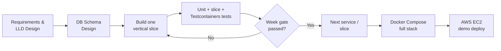
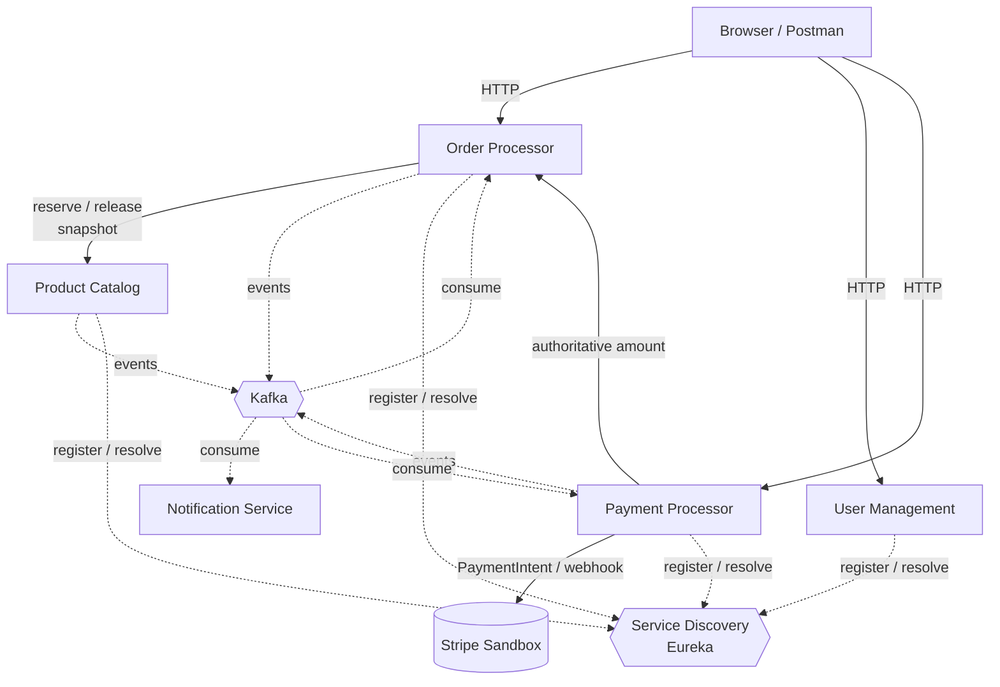
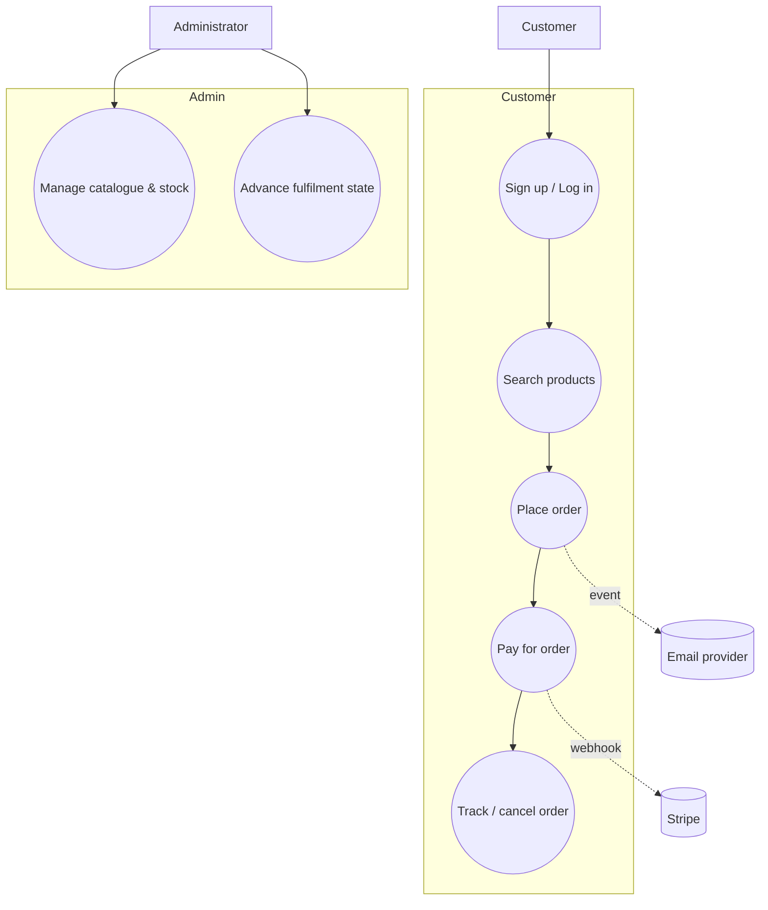
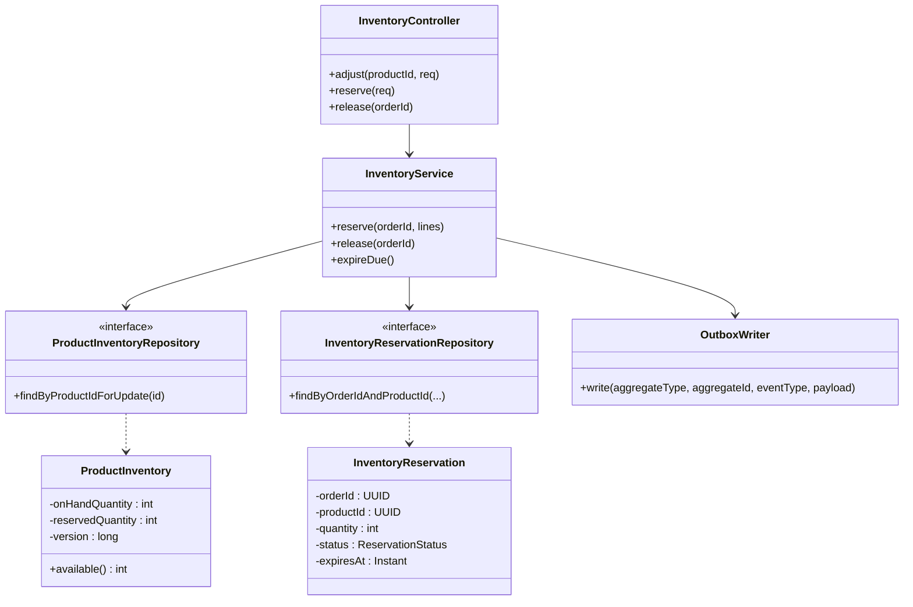
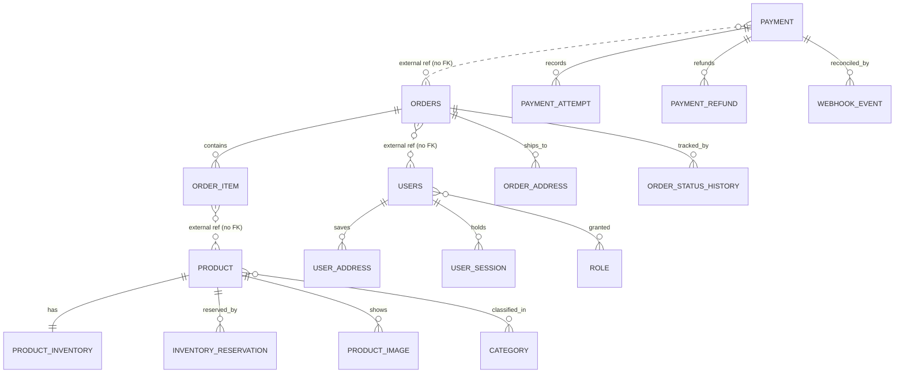
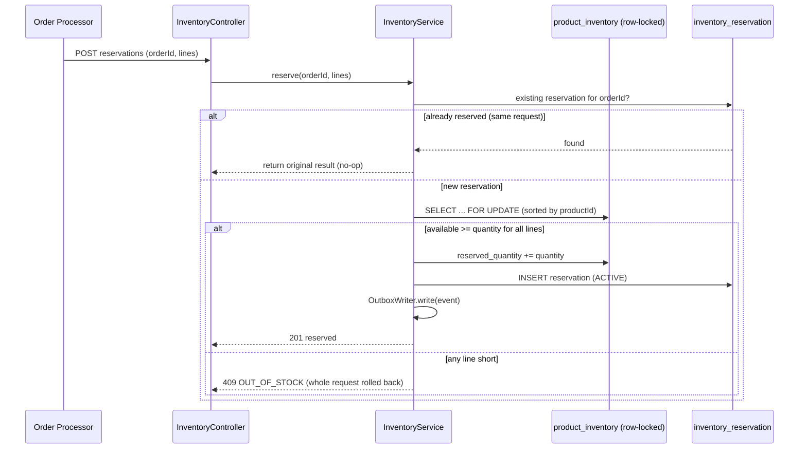
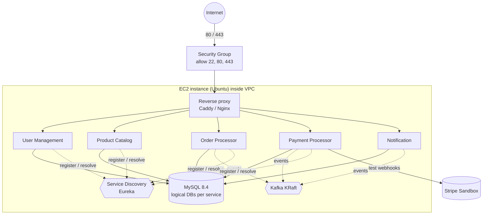

# Applied Software Project Report

**By**

\<Full Name of the Student\>

**A Master's Project Report submitted to Scaler Neovarsity - Woolf in partial fulfillment of the requirements for the degree of Master of Science in Computer Science**

\<Month, Year of Submission\>

**Scaler Mentee Email ID:** \<Registered Scaler Email ID\>
**Thesis Supervisor:** Naman Bhalla
**Date of Submission:** DD/MM/YYYY

---

## Certification

I confirm that I have overseen / reviewed this applied project and, in my judgment, it adheres to the appropriate standards of academic presentation. I believe it satisfactorily meets the criteria, in terms of both quality and breadth, to serve as an applied project report for the attainment of Master of Science in Computer Science degree. This applied project report has been submitted to Woolf and is deemed sufficient to fulfill the prerequisites for the Master of Science in Computer Science degree.

Naman Bhalla
…………………
Project Guide / Supervisor

---

## Declaration

I confirm that this project report, submitted to fulfill the requirements for the Master of Science in Computer Science degree, completed by me from \<Project Module start date\> to \<Module end date\>, is the result of my own individual endeavor. The Project has been made on my own under the guidance of my supervisor with proper acknowledgement and without plagiarism. Any contributions from external sources or individuals, including the use of AI tools, are appropriately acknowledged through citation. By making this declaration, I acknowledge that any violation of this statement constitutes academic misconduct. I understand that such misconduct may lead to expulsion from the program and/or disqualification from receiving the degree.

**\<Full Name of the Candidate\>**

**\<Signature of the Candidate\>**                                                                       Date: XX Month 20XX

---

## Acknowledgment

I would like to thank my family for their patience during the many late nights this project demanded, and my instructors and mentors at Scaler Neovarsity for the guidance that shaped the way I now think about designing software. A particular thanks goes to my project guide, Naman Bhalla, whose feedback repeatedly pushed me to justify my design decisions rather than simply making them. I am also grateful to my peers, whose questions during review sessions exposed gaps I would otherwise have missed. Whatever I have learnt about building resilient, service-oriented systems is a direct result of this support.

---

## Table of Contents

1. [List of Tables](#list-of-tables)
2. [List of Figures](#list-of-figures)
3. [Abstract](#abstract)
4. [Project Description](#1-project-description)
5. [Requirement Gathering](#2-requirement-gathering)
6. [Class Diagrams](#3-class-diagrams)
7. [Database Schema Design](#4-database-schema-design)
8. [Feature Development Process](#5-feature-development-process)
9. [Deployment Flow](#6-deployment-flow)
10. [Technologies Used](#7-technologies-used)
11. [Conclusion](#8-conclusion)
12. [References](#references)

---

## List of Tables

| Table No. | Title |
| :---- | :---- |
| 2.01 | Functional requirements by service |
| 2.02 | Non-functional requirements |
| 2.03 | Primary actors and their goals |
| 2.04 | Feature set of the platform |
| 4.01 | Product Catalog owned tables |
| 4.02 | Order state machine transitions |
| 7.01 | Technology baseline summary |

---

## List of Figures

| Figure No. | Title |
| :---- | :---- |
| 1.01 | Project development process |
| 1.02 | System context and service communication |
| 2.01 | Use case diagram for the customer purchase journey |
| 3.01 | Product Catalog class diagram (hexagonal ports and adapters) |
| 4.01 | Entity relationship diagram across the four stateful service schemas |
| 5.01 | Inventory reservation request flow |
| 6.01 | AWS single-host deployment topology |

---

## Abstract

Online retail platforms have to do several awkward things at the same time: show an accurate catalogue, never sell stock they do not have, take money safely, and keep the customer informed, all while remaining available under load. This project is my attempt to build such a platform the way it is actually built in industry — as a set of independently deployable microservices rather than one large application.

The system is built as five Spring Boot business services (Product Catalog, User Management, Order Processor, Payment Processor, and Notification) plus a Netflix Eureka service-discovery registry, all living in a single Maven monorepo and communicating through a mix of narrow synchronous HTTP calls and asynchronous Kafka events. MySQL is the system of record, with each stateful service owning its own logical database and no cross-service foreign keys. Payments are handled through Stripe in test mode, so the platform makes genuine API and webhook calls without ever moving real money or touching a raw card number.

The core engineering ideas I wanted to demonstrate are idempotency (so a retried request never charges or reserves twice), the transactional outbox pattern (so a service never loses an event after committing its data), and saga-style compensation (so a failed step can be safely reversed instead of relying on a distributed transaction). The Notification service consumes order and payment events, and the Eureka registry ties them together. The feature I describe in depth is the concurrency-safe inventory reservation mechanism in Product Catalog, which I verified cannot oversell even when two orders race for the last unit of stock.

The practical value of this work is that the same patterns used here — service ownership, event-driven decoupling, and idempotent processing — are the patterns that let real e-commerce, ticketing, and banking systems stay correct and available. This report explains the requirements, the design, feature in depth, and how the system is intended to be deployed on AWS.

---

## 1. Project Description

The objective of this project is to design and build a backend for an e-commerce platform that behaves correctly under the conditions that actually break naive shopping systems: concurrent orders for the same item, retried network requests, payment provider callbacks arriving out of order, and services being temporarily unavailable. Rather than build one monolith and hope it scales, I chose a microservices architecture so that each business capability could be owned, deployed, and reasoned about on its own.

The platform is broken into five business services:

- **Product Catalog Service** — manages products, categories, images, stock levels, and the reservation/release of inventory for orders.
- **User Management Service** — handles signup, login, JWT issuance, profiles, addresses, and roles.
- **Order Processor Service** — the source of truth for an order's amount, currency, ownership, and lifecycle state; it orchestrates the purchase saga.
- **Payment Processor Service** — talks to Stripe, records payment and refund attempts, and ingests verified webhooks.
- **Notification Service** — consumes order and payment events and delivers emails, without ever blocking a business transaction.

Around these sit a **Service Discovery** component — a single-node Netflix Eureka registry that lets the services find each other by name rather than by hard-coded host — and the infrastructure dependencies — MySQL, a single Kafka broker, and a reverse proxy — which are not themselves "microservices" but the plumbing the services rely on.

A guiding decision throughout was to keep the scope honest for a learning project. Instead of trying to build all five services superficially, I built one runnable vertical slice at a time and only moved forward when the current slice passed its tests. The four core services — Product Catalog, User Management, Order Processor, and Payment Processor — are fully implemented, tested, and registered with Eureka; the Notification service is implemented as a durable Kafka consumer; and the remaining work (cancellation/refund saga end to end) is future scope.


**Figure 1.01:** Project development process. *(Figure captions go below figures.)*



The high-level communication between the services is deliberately asymmetric. Business calls that must be answered immediately — such as "reserve this stock" or "what is the authoritative total for this order" — are synchronous HTTP calls kept as narrow as possible. Everything else — order confirmation, refund outcomes, notifications — flows as events over Kafka so that no service has to wait on another to commit its own work.


**Figure 1.02:** System context and service communication.



The relevance of this project is straightforward: almost every online business — retail, food delivery, ticketing, travel — solves exactly these problems. The specific techniques I implement here (idempotency keys, transactional outbox, optimistic and pessimistic locking, and saga compensation) are the same building blocks those companies use to avoid double-charging customers and overselling stock.

---

## 2. Requirement Gathering

### 2.1 Functional Requirements

The functional requirements were derived per service, since each service owns a distinct slice of the business.

**Table 2.01:** Functional requirements by service. *(Table captions go above tables.)*

| Service | Key functional requirements |
| :---- | :---- |
| Product Catalog | Create/update/soft-delete products and categories; upload image metadata; search products with bounded pagination and safe sorting; adjust on-hand stock; reserve and release inventory idempotently per order; expire stale reservations. |
| User Management | Signup with hashed passwords; login returning a short-lived JWT and a rotating refresh token; refresh and logout; retrieve/update profile; manage shipping and billing addresses; assign CUSTOMER/ADMIN roles. |
| Order Processor | Create an order from product IDs and quantities with an idempotency key; snapshot SKU, name, price, currency, and addresses; compute subtotal and total; expose order detail, history, and status; cancel orders subject to state rules. |
| Payment Processor | Create exactly one Stripe PaymentIntent per order using authoritative amounts loaded from Order; verify and deduplicate Stripe webhooks; record payment attempts; issue refunds on cancellation. |
| Notification | Consume order/payment events, deduplicate them, render a template, and deliver email with retry — without blocking any business transaction. |

### 2.2 Non-Functional Requirements

**Table 2.02:** Non-functional requirements.

| Category | Requirement |
| :---- | :---- |
| Correctness | Stock must never be oversold; a retried request must never have a second business effect. |
| Reliability | An event must not be lost after its business data is committed (transactional outbox); a consumer crash must result in safe redelivery, not data loss. |
| Security | Passwords stored only as Argon2id/bcrypt hashes; JWT access tokens short-lived; only Stripe test keys accepted in demo profiles; no raw card data ever reaches the backend. |
| Isolation | Each service owns its own database; no cross-service foreign keys or joins. |
| Observability | Every service exposes liveness/readiness probes; every mutating request carries a correlation ID. |
| Portability | The whole stack runs from one `docker compose up` on a laptop and on a single EC2 instance. |
| Maintainability | Code follows SOLID and a ports-and-adapters layout so providers (e.g. payment gateway) can be swapped without touching business logic. |

### 2.3 Users and Use Cases

The system has three principal actors.

**Table 2.03:** Primary actors and their goals.

| Actor | Goal |
| :---- | :---- |
| Customer | Browse products, place an order, pay for it, track its status, and cancel or get refunded when needed. |
| Administrator | Manage the catalogue and stock, and transition orders through fulfilment states. |
| External systems | Stripe (payment confirmation via webhook) and the email provider (delivery). |


**Figure 2.01:** Use case diagram for the customer purchase journey.



A representative use case is *Place Order*: an authenticated customer submits product IDs and quantities with an idempotency key. The Order service fetches current product snapshots and asks Product Catalog to reserve stock. If reservation succeeds, the order is persisted as `PENDING_PAYMENT` and an `OrderCreated` event is written to the outbox in the same transaction. If the customer submits the same request again (a double-click or a network retry), the idempotency key ensures they get the original order back rather than a duplicate.

### 2.4 Feature Set

**Table 2.04:** Feature set of the platform.

| # | Feature | Owning service | Status |
| :---- | :---- | :---- | :---- |
| 1 | Product & category CRUD with soft delete | Product Catalog | Implemented |
| 2 | Product search with bounded pagination and allow-listed sorting | Product Catalog | Implemented |
| 3 | Concurrency-safe, idempotent inventory reservation & release | Product Catalog | Implemented |
| 4 | Reservation expiry worker | Product Catalog | Implemented |
| 5 | Transactional outbox for product/inventory events | Product Catalog | Implemented |
| 6 | Signup / login / JWT / roles | User Management | Implemented |
| 7 | Idempotent order creation with snapshots | Order Processor | Implemented |
| 8 | Stripe test-mode payments with verified webhooks | Payment Processor | Implemented |
| 9 | Kafka-driven order confirmation | Order + Payment | Implemented |
| 10 | Cancellation and refund saga | Order + Payment | Partially implemented |
| 11 | Durable, non-blocking notifications | Notification | Implemented |
| 12 | Service discovery / registry | Service Discovery (Eureka) | Implemented |

---

## 3. Class Diagrams

The low-level design follows a hexagonal (ports-and-adapters) structure. The important idea is that application and domain code depend only on interfaces (ports); Spring infrastructure classes implement those interfaces (adapters). This is what makes the `PaymentGateway` swappable and keeps the `CreateOrderService` free of any `WebClient` or `JpaRepository` reference.

The diagram below shows the Product Catalog service, used here as the representative example; the same ports-and-adapters structure is repeated across the other implemented services. A controller handles only HTTP concerns and delegates to a service; the service coordinates the business action and talks to repositories and the outbox writer through ports.


**Figure 3.01:** Product Catalog class diagram (hexagonal ports and adapters).



A few design rules are visible in this structure. The controller never contains business logic; overselling is prevented inside `InventoryService` using a pessimistic write lock combined with an optimistic `@Version` column. The reservation record carries the `orderId` so that reserving twice for the same order is a no-op rather than a second deduction, and the `OutboxWriter` persists the domain event in the *same* transaction as the inventory change so the event can never be lost.

The same skeleton repeats across the other services. For example Payment Processor has a `PaymentController`, a `PaymentService`, and a `PaymentGateway` port whose only real implementation is `StripePaymentGateway`; in tests the port is replaced with a Mockito stub so the whole payment flow can be exercised without calling Stripe on every build. Keeping the port narrow is what lets me test the payment logic in isolation while still driving the genuine Stripe SDK from the integration profile.

---

## 4. Database Schema Design

The data model follows one strict boundary rule: **each stateful microservice owns a separate MySQL schema, and physical foreign keys exist only within the owning service.** An identifier that points at another service (for example a `user_id` on an order) is stored as a plain `CHAR(36)` with no FK constraint, and it is validated at the API or event boundary rather than by the database. This is what actually enforces service independence — you cannot accidentally write a query that joins two services together.

### 4.1 Conventions

- **Identifiers:** application-generated `CHAR(36)` UUID strings, mapped in Java as `java.util.UUID`. Slightly wasteful on space but very easy to inspect by hand.
- **Time:** `DATETIME(6)` stored in UTC.
- **Money:** `DECIMAL(19,4)` plus a `CHAR(3)` ISO-4217 currency code — never `FLOAT` or `DOUBLE`.
- **Optimistic locking:** aggregate tables carry a `version BIGINT` used with JPA `@Version`.
- **Deletion:** products are soft-deleted so old order snapshots stay explainable; orders and payments are retained, never deleted.
- **Reliability:** producing services keep an `outbox_event` table; a consuming service that must not double-process keeps an `inbox_event` table (Order Processor) or a provider-event dedup table (Payment Processor's `webhook_event`), while the Notification consumer deduplicates by dropping any event it cannot process.

### 4.2 Schema Ownership

Textually, the ownership is as follows:

**product_catalog_db** owns: product, category, product_category, product_inventory, inventory_reservation, product_image, outbox_event.
**user_management_db** owns: users, user_credential, user_session, user_address, role, user_role, outbox_event.
**order_processor_db** owns: orders, order_item, order_address, order_status_history, order_idempotency, inbox_event, outbox_event.
**payment_processor_db** owns: payment, webhook_event, outbox_event. (Payment attempts and refunds are recorded on the `payment` row and its lifecycle state; the inbound Stripe webhook is deduplicated through `webhook_event`.)

The Notification service and the Service Discovery (Eureka) registry are **stateless** and own no schema: Notification consumes events straight from Kafka and renders/sends them, deduplicating by dropping any event it cannot process rather than persisting an inbox, and Eureka simply holds an in-memory registry of live instances.

As a worked textual example, the core Product Catalog tables are described below in the same style used in the schema design document.

**Table 4.01:** Product Catalog owned tables (selected columns).

```
product
  - id            CHAR(36)      Primary Key
  - sku           VARCHAR(64)   Unique
  - name          VARCHAR(255)
  - status        VARCHAR(32)   ACTIVE | INACTIVE | DRAFT | DISCONTINUED
  - base_price    DECIMAL(19,4)
  - currency      CHAR(3)
  - deleted_at    DATETIME(6)   soft-delete marker
  - version       BIGINT        optimistic lock

product_inventory
  - product_id        CHAR(36)  Primary Key, FK -> product.id (one row per product)
  - on_hand_quantity  INT
  - reserved_quantity INT       available = on_hand - reserved
  - version           BIGINT
  - CHECK(reserved_quantity <= on_hand_quantity)

inventory_reservation
  - id          CHAR(36)   Primary Key
  - order_id    CHAR(36)   external reference to Order service (no FK)
  - product_id  CHAR(36)   FK -> product.id
  - quantity    INT
  - status      VARCHAR(32) ACTIVE | RELEASED | CONSUMED | EXPIRED
  - expires_at  DATETIME(6)
  - UNIQUE(order_id, product_id)   <- this is what makes reservation idempotent

Foreign Keys (within Product Catalog only):
  - product_category(product_id)  refers product(id)
  - product_category(category_id) refers category(id)
  - product_inventory(product_id) refers product(id)
  - inventory_reservation(product_id) refers product(id)

Cardinality of relations:
  - product to category      -> m:m (through product_category)
  - product to inventory     -> 1:1
  - product to reservation   -> 1:m
```

The `UNIQUE(order_id, product_id)` constraint on `inventory_reservation` is small but important: it is the database-level guarantee that a retried reservation for the same order and product cannot create a duplicate hold.

Diagrammatically, the cross-service picture looks like this. Solid lines are real foreign keys inside one schema; dashed lines are logical references across services that are *not* enforced by the database.


**Figure 4.01:** Entity relationship diagram across the four stateful service schemas.



### 4.3 Order State and Transitions

The order lifecycle is driven by a pure state machine so that every transition is validated by domain code rather than scattered through controllers.

**Table 4.02:** Order state machine transitions.

| From state | Allowed next states |
| :---- | :---- |
| PENDING_PAYMENT | CONFIRMED, PAYMENT_FAILED, CANCELLED |
| CONFIRMED | PROCESSING, CANCELLATION_PENDING |
| PROCESSING | SHIPPED, CANCELLATION_PENDING |
| SHIPPED | DELIVERED |
| DELIVERED | (terminal) |
| PAYMENT_FAILED | PENDING_PAYMENT, CANCELLED |
| CANCELLATION_PENDING | CANCELLED (refund failure keeps it pending for retry) |
| CANCELLED | (terminal) |

---

## 5. Feature Development Process

For the in-depth feature I chose **inventory reservation**, because it is the one place where a naive implementation fails silently and expensively — it oversells stock. It is also the feature I actually implemented and proved with tests, so I can describe it honestly rather than in theory.

### 5.1 The problem

When two customers try to buy the last unit of a product at nearly the same moment, both requests read "1 available", both decide there is enough stock, and both proceed — and now I have sold two of something I have one of. The classic "read then write" pattern has a race condition. On top of that, network retries mean the *same* customer's reservation request might arrive twice, and I must not treat that as two separate holds.

### 5.2 The request flow

The Order Processor calls the internal reservation endpoint on Product Catalog:

```
POST /internal/v1/inventory/reservations
{
  "orderId": "<order-uuid>",
  "lines": [ { "productId": "<uuid>", "quantity": 2 } ]
}
```


**Figure 5.01:** Inventory reservation request flow.



### 5.3 How the flow maps to MVC

1. **API request payload** — the JSON above, validated by bean validation (non-null order ID, positive quantities).
2. **Controller** — `InventoryController.reserve()` does only HTTP mapping and hands off to the service.
3. **Service** — `InventoryService.reserve()` holds the whole business decision inside one `@Transactional` method.

### 5.4 The correctness mechanisms

I used three mechanisms together, because no single one is sufficient:

- **Pessimistic row lock:** the service loads each inventory row with `SELECT ... FOR UPDATE` (`findByProductIdForUpdate`). A concurrent reservation for the same product blocks until the first transaction commits, so the second one reads the *already decremented* quantity.
- **Optimistic `@Version`:** a backstop on the aggregate that catches any lost-update that slips past the lock.
- **Idempotency on `(order_id, product_id)`:** before doing anything, the service checks for an existing reservation for that order. A replayed request returns the original result. A replay with a *different* quantity for the same order returns `409 DUPLICATE_REQUEST`, because that is a genuine conflict rather than a retry.

Multi-line reservations are all-or-nothing: the lines are sorted by product ID (to avoid deadlocks between two orders locking the same products in opposite order) and the entire transaction rolls back if any single line is short, so a customer never ends up with a partial hold.

### 5.5 Verification

The behaviour is proven by tests rather than asserted by hope:

- `InventoryConcurrencyTest.concurrentReservations_cannotOversell` fires two reservations at the last unit of stock and asserts exactly one succeeds and the other gets `OUT_OF_STOCK`.
- `InventoryReservationTest` covers idempotent replay (one business effect), release replay (no double increment), expiry running exactly once, and the different-quantity replay returning 409.
- `reserve_multiLine_isAllOrNothing` confirms partial reservations roll back.

The self-contained suite runs on in-memory H2 with no external dependency (`.\mvnw.cmd test` → 30 passed at the Week 2 gate), and a Testcontainers test applies the real Flyway migrations against a genuine MySQL 8.4 container during `mvn verify` when Docker is available. The same testing discipline extends across the monorepo: User Management, Order Processor, and Payment Processor each ship their own unit, slice, and Testcontainers migration tests (including WireMock tests for the cross-service HTTP clients and dedup tests for the inbox), so every service is proven the same way this one is.

### 5.6 Performance note

The performance goal here is not raw throughput but *correctness under contention*. The pessimistic lock is scoped as tightly as possible — only the specific inventory rows are locked, only for the duration of the reservation transaction — so unrelated products are never blocked. Because reservation is idempotent, the Order service can safely retry on a timeout without inflating held stock, which removes an entire class of "phantom reserved quantity" bugs that would otherwise need a manual clean-up job. In other words, the optimisation I care about is the elimination of a correctness failure, measured by the concurrency test passing 100% of the time rather than by a millisecond figure.

---

## 6. Deployment Flow

The deployment target: the same stack is intended to run on a laptop and on a single AWS EC2 instance. 

At the time of writing, the *dependency* stack — MySQL 8.4 and a single-node Kafka broker (KRaft, no ZooKeeper) — is containerised and brought up with one command (`docker compose -f compose.deps.yaml up -d`), while the five Spring services and the Eureka registry currently run as executable JARs built by Maven against that dependency stack. Packaging each service into its own image behind a single full-stack Compose file is the planned next step; the figure below shows that intended end state.


**Figure 6.01:** AWS single-host deployment topology.



**EC2 (Elastic Compute Cloud).** A single Ubuntu instance runs Docker Engine for the dependency stack and hosts the Spring services. In the intended end state all five services listen on container port 8080 and are reachable only through the private Compose network; only the reverse proxy publishes ports to the host. **Service discovery** is provided by the Netflix Eureka registry, so each service registers itself on startup and resolves its peers by logical name rather than by a hard-coded host and port.

**VPC (Virtual Private Cloud).** The instance sits inside a VPC that gives it network isolation. The application services, MySQL, and Kafka never have their ports exposed to the internet — port 3306 and port 9092 stay on the private Compose network and are deliberately not published on the EC2 host.

**Security Groups.** The instance's security group is the firewall. It allows inbound `22` (SSH, ideally restricted to my own IP), `80`, and `443` only. Everything else is denied, so the database and broker cannot be reached from outside.

**RDS (Relational Database Service).** For this learning stage MySQL runs as a pinned container with a named volume, which keeps the whole thing to one host and one `docker compose up`. In a production-shaped evolution this container would be replaced by a managed **RDS MySQL** instance, moving backups, patching, and failover to AWS while the application configuration changes only its `DB_HOST`.

**Cache.** The current design does not yet add a cache, but the natural place for one is the Product Catalog read path (product detail and search), where a managed **ElastiCache (Redis)** layer would cut database load for hot products. It is deliberately deferred until the purchase flow works, to avoid optimising something that is not yet a bottleneck.

**Managed infrastructure.** Beyond a single instance, the same containers could run on **Elastic Beanstalk** or a container service, which would add rolling deploys and health-based restarts. That is out of scope for this project, and building the per-service container images is the immediate next step — planned as multi-stage Dockerfiles with a non-root runtime user and explicit JVM memory bounds (`-XX:MaxRAMPercentage=70`).

Secrets (database passwords, the JWT signing key, and the Stripe test keys) are supplied through a `.env` file that is never committed. The demo profile refuses to start if it is given a live Stripe key, which is a small guard that makes it impossible to accidentally point the learning deployment at real money.

---

## 7. Technologies Used

**Table 7.01:** Technology baseline summary.

| Area | Technology | Why it was chosen |
| :---- | :---- | :---- |
| Language / runtime | Java 21 (LTS) | Long-term support, records, and modern language features. |
| Framework | Spring Boot 3.5.x | Web, Validation, Security, Data JPA, and Actuator in one consistent stack. |
| Service discovery | Spring Cloud Netflix Eureka | Lets services register and resolve each other by logical name instead of hard-coded hosts. |
| Build | Maven multi-module monorepo | One parent POM pins versions; each service builds its own executable JAR. |
| Database | MySQL 8.4 (LTS) + Flyway | Reliable relational store; Flyway makes schema changes reproducible per service. |
| Messaging | Apache Kafka (KRaft, single node) | Durable, replayable event log for asynchronous decoupling. |
| Payments | Stripe (test mode) | Real API/webhook behaviour without moving real money or storing card data. |
| Testing | JUnit 5, Mockito, Testcontainers, WireMock | Fast unit tests plus real-container integration tests. |
| Packaging / deploy | Docker + Docker Compose on AWS EC2 | One command brings up the whole stack locally and on the host. |

**Spring Boot.** Spring Boot is the backbone of every service. It gives me dependency injection (which is what makes the ports-and-adapters design practical), declarative transactions with `@Transactional`, request validation, and production endpoints through Actuator. In real life the same framework runs a huge share of enterprise Java backends — banks, retailers, and streaming services — precisely because it standardises the boring parts and lets you focus on domain logic.

**MySQL.** MySQL is the system of record. Each service owns its own logical database, uses HikariCP for connection pooling, and manages its own schema through Flyway migrations. I rely on real relational features — unique constraints, check constraints, and row-level locking (`SELECT ... FOR UPDATE`) — to enforce correctness that would be fragile if left to application code alone. MySQL powers a large part of the web, from content platforms to e-commerce catalogues.

**Apache Kafka.** Kafka is the asynchronous spine. Services publish domain events (`OrderCreated`, `PaymentSucceeded`, `InventoryReservationExpired`) to topics keyed by order ID, and other services consume them at their own pace. Because Kafka is a durable, replayable log, a consumer that was down simply catches up when it returns. This is exactly how large systems — ride-hailing, logistics tracking, fraud detection — move events between teams without coupling their databases together. In this project Kafka is what lets the Notification service exist without any business transaction ever waiting on it.

**Spring Cloud Netflix Eureka.** Eureka is the service registry. On startup each service registers itself with the registry, and the Order and Payment services resolve their peers (for example Product Catalog and Order) by logical service name rather than by a hard-coded address. This keeps inter-service HTTP calls from breaking every time a host or port changes, and it is the same discovery mechanism that underpins many Spring-based microservice estates in industry. It runs here as a single node, which is sufficient for this project scope.

**Stripe (test mode).** Stripe handles the actual payment mechanics. The backend only ever creates a PaymentIntent and reacts to a signed webhook; the card number is entered directly into Stripe's UI elements in the browser and never touches my server or database. Using test keys and test cards (`4242 4242 4242 4242`) means the full flow — intent, confirmation, webhook, refund — behaves like production without any real charge. This is the standard way modern startups add payments without taking on the full weight of PCI compliance themselves.

**Docker and Docker Compose.** Docker packages each service into an image built with a multi-stage Dockerfile, and Compose wires the services, MySQL, Kafka, and a reverse proxy into one network. The practical payoff is that "works on my machine" becomes "works anywhere Docker runs" — the identical Compose file starts the stack on my laptop and on EC2. Container orchestration in this style underpins a large fraction of cloud deployments today.

**Testcontainers and WireMock.** These make the tests trustworthy. Testcontainers spins up a real MySQL 8.4 (and later Kafka) container during `mvn verify`, so migrations and JPA mappings are validated against the real database rather than an approximation. WireMock stands in for outbound HTTP dependencies so I can assert things like outbound idempotency headers without calling the real provider on every build.

---

## 8. Conclusion

**Key takeaways.** The most valuable thing I learned from this project is that in a distributed system, correctness is not something you get for free from the database — you have to design for it explicitly. Idempotency keys, the transactional outbox pattern, and saga-style compensation are not academic curiosities; they are the difference between a system that double-charges customers under retries and one that does not. Building the inventory reservation feature end to end, and then writing the concurrency test that actually tried to break it, taught me more about locking and transaction boundaries than any amount of reading had.

**Practical applications.** Every technology used here maps directly to how real backends are built. Spring Boot and MySQL run a large share of enterprise systems; Kafka is the standard way large organisations move events between independent teams; Stripe is how a great many businesses accept payments without owning the risk of raw card data; and Docker is how nearly all of it gets shipped. The patterns — service ownership, event-driven decoupling, and idempotent processing — are exactly what keep e-commerce, ticketing, and banking platforms correct while remaining available.

**Limitations and future improvements.** This is honestly a learning deployment, and it shows in a few places. It runs on a single host, so it is not highly available: if the EC2 instance dies, everything is down. The MySQL and Kafka nodes are single instances with no replication, and the Eureka registry is a single node. The four core services (Product Catalog, User Management, Order Processor, and Payment Processor) are fully implemented and tested and the Notification service consumes events, but the cancellation/refund saga is only partially wired end to end, and the application services are not yet packaged as container images — only the MySQL and Kafka dependency stack is containerised today. There is no cache layer, no distributed tracing backend, and no automated CI pipeline yet. On the cost side, a single small EC2 instance is cheap, but a production-shaped version — managed RDS with multi-AZ failover, ElastiCache, a multi-broker Kafka cluster, and an orchestrator — would cost meaningfully more and is deferred until the core purchase-and-refund flow is complete. The clearest next steps are to finish the cancellation/refund saga so a full end-to-end purchase and reversal crosses all the services, package every service into its own image behind a single Compose file, then move the database to managed RDS and add a Redis cache on the catalogue read path.

---

## References

1. Spring Boot Reference Documentation, Pivotal/VMware, https://docs.spring.io/spring-boot/ (accessed 2026).
2. MySQL 8.4 Reference Manual, Oracle Corporation, https://dev.mysql.com/doc/ (accessed 2026).
3. Apache Kafka Documentation, Apache Software Foundation, https://kafka.apache.org/documentation/ (accessed 2026).
4. Stripe API and Webhooks Documentation, Stripe Inc., https://docs.stripe.com/ (accessed 2026).
5. Testcontainers for Java Documentation, https://java.testcontainers.org/ (accessed 2026).
6. Docker and Docker Compose Documentation, Docker Inc., https://docs.docker.com/ (accessed 2026).
7. Chris Richardson, *Microservices Patterns*, Manning Publications, 2018 (transactional outbox, saga, and idempotent consumer patterns).
8. Flyway Documentation, Redgate, https://documentation.red-gate.com/flyway (accessed 2026).
9. Project design documents: `Ecommerce_LLD_Design.md`, `Ecommerce_DB_Schema_Design.md`, `Ecommerce_Implementation_Plan.md`, and `Ecommerce_Docker_AWS_Deployment_Guide.md` (this repository).
